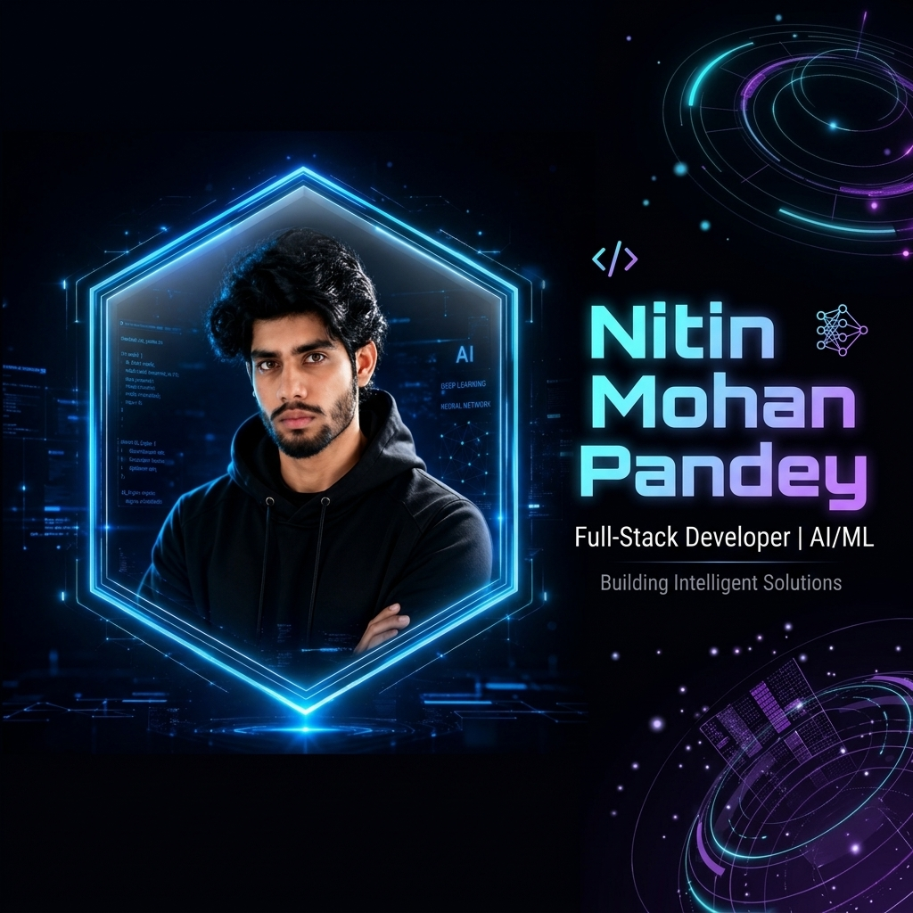

# Nitin Mohan - Premium Developer Portfolio

<div align="center">
  
</div>

<br />

<div align="center">
  <a href="https://nitinpandey-portfolio.vercel.app" target="_blank">
    
  </a>
  
  
  
  
</div>

<br />

A stunning, highly optimized, and production-ready personal developer portfolio. Built with modern web technologies, this portfolio features a dark cyber/AI aesthetic, extremely smooth framer-motion animations, server-side GitHub integrations, and a fully functional EmailJS contact system.

---

## ✨ Features

- **Modern Cyber Aesthetic:** Deep space blacks, neon cyan/purple glows, glassmorphism, and meticulously crafted 3D  effects.
- **Flawless Animations:** Advanced exit/enter animations, orchestrations, smooth scroll, and physics-based interactions powered by Framer Motion.
- **Mobile First & Touch Optimized:** 100% responsive layout with native mobile touch states mirroring desktop hover interactions.
- **GitHub API Integration:** Secure, server-side fetching of live repository data (stars, forks, topics) with built-in ISR caching.
- **EmailJS Contact Form:** Live contact routing straight to your inbox without requiring a custom backend.
- **Next-Level SEO Setup:** Dynamically generated `sitemap.xml`, `robots.txt`, Canonical tags, and a fully configured Open Graph image pipeline for social media link sharing.
- **Extreme Performance:** WebP image compression, GPU-accelerated transforms (`will-change: transform`), layout thrashing elimination, and zero-error ESLint compliance.

## 🛠️ Tech Stack

### Core Frameworks
- **[Next.js (App Router)](https://nextjs.org/)** - React framework for production
- **[React 19](https://react.dev/)** - UI Library
- **[TypeScript](https://www.typescriptlang.org/)** - Static typing

### Styling & UI
- **[Tailwind CSS v4](https://tailwindcss.com/)** - Utility-first CSS framework
- **[Framer Motion](https://www.framer.com/motion/)** - Production-ready animation library
- **[Lucide React](https://lucide.dev/)** & **[React Icons](https://react-icons.github.io/react-icons/)** - Iconography

### Services & Integrations
- **[GitHub REST API](https://docs.github.com/en/rest)** - Dynamic project data
- **[EmailJS](https://www.emailjs.com/)** - Form submission handling
- **[Vercel](https://vercel.com/)** - Hosting & Deployment

## 📂 Project Structure

```text
├── public/                 # Static assets (images, favicon, OpenGraph banner)
├── src/
│   ├── app/                # Next.js App Router (pages, layouts, api routes)
│   │   └── api/github/     # Secure server-side GitHub API route handler
│   ├── components/         # Reusable React components
│   │   ├── about/          # About me section
│   │   ├── certifications/ # Certifications with WebP optimized images
│   │   ├── contact/        # Form & Social links with touch-glow features
│   │   ├── hero/           # Landing section with Signature animation
│   │   ├── layout/         # Navbar, Footer, and structural components
│   │   ├── projects/       # Dynamic GitHub repo cards
│   │   └── skills/         # Optimized 3D Skill grid
│   ├── data/               # Static text data, profile info, and config
│   ├── hooks/              # Custom React hooks (e.g., useGithub, useActiveSection)
│   ├── lib/                # Utilities (Tailwind merge, SEO configs, GitHub fetcher)
│   └── types/              # TypeScript interfaces
├── next.config.ts          # Next.js configuration (Dev IPs configured)
└── package.json            # Project dependencies and scripts
```

## 📸 Screenshots

*(To be added upon final deployment: Replace these placeholders with live screenshots)*

<div align="center">
  
  
</div>

## 🚀 Installation & Local Development

1. **Clone the repository:**
   ```bash
   git clone https://github.com/nitinmohan18/nitin-portfolio.git
   cd nitin-portfolio
   ```

2. **Install dependencies:**
   ```bash
   npm install
   ```

3. **Set up Environment Variables:**
   Create a `.env.local` file in the root directory (see [Environment Variables](#-environment-variables) below).

4. **Run the development server:**
   ```bash
   npm run dev
   ```
   Open [http://localhost:3000](http://localhost:3000) to view it in your browser. Mobile testing on local networks is supported.

## 🔐 Environment Variables

To fully run the project locally and in production, you must configure the following variables in `.env.local` (local) and in your Vercel Project Settings (production):

| Variable | Description | Required |
|----------|-------------|:--------:|
| `NEXT_PUBLIC_SITE_URL` | Your production domain (e.g., `https://nitinpandey-portfolio.vercel.app`). Required for SEO, canonical tags, and Sitemap generation. | Yes |
| `NEXT_PUBLIC_EMAILJS_SERVICE_ID` | Your EmailJS Service ID (for Contact form). | Yes |
| `NEXT_PUBLIC_EMAILJS_TEMPLATE_ID` | Your EmailJS Template ID. | Yes |
| `NEXT_PUBLIC_EMAILJS_PUBLIC_KEY` | Your EmailJS Public Key. | Yes |
| `GITHUB_TOKEN` | A personal access token to prevent API rate limiting when fetching your repositories. **Must stay server-side only.** | Yes |

## 📦 Available Scripts

- `npm run dev`: Starts the local Next.js development server.
- `npm run build`: Creates a highly optimized production build.
- `npm run start`: Starts the production server based on the output of the build.
- `npm run lint`: Runs ESLint to check for code quality and strict typing errors.

## ⚡ Performance & Optimization

During development, extensive performance audits were conducted to ensure top-tier Lighthouse scores:
- **Image Compression:** Large assets like certificates were converted to `WebP` (reducing size by up to 95%).
- **Animation Offloading:** Framer Motion components utilize `will-change: transform, opacity` to force dedicated GPU layers and eliminate CPU rendering lag on mobile devices.
- **Render Opt-Outs:** Individual entry animations on deeply nested badge components were stripped in favor of smooth, parent-level fading to stop "waterfall" rendering stutter.
- **Server-Side Fetching:** GitHub data is fetched server-side using App Router handlers, ensuring zero client-side credential exposure and allowing caching.

## 🔍 SEO Features

This project is built to dominate search engine rankings and social media shares:
- **Dynamic Metadata:** Title, Description, and OpenGraph tags are handled elegantly via `src/lib/seo.ts`.
- **Automated Sitemap & Robots.txt:** `src/app/sitemap.ts` and `src/app/robots.ts` automatically track the canonical domain provided in the environment variables.
- **Social Previews:** A stunning `og-image.png` is generated and automatically served when links are shared on LinkedIn, Twitter/X, Discord, and WhatsApp.

## 🌐 Deployment (Vercel)

This project is perfectly tailored for [Vercel](https://vercel.com).

1. Push your code to a GitHub repository.
2. Go to Vercel and **Import** the repository.
3. In the Vercel project configuration, expand **Environment Variables** and add all the keys listed in the section above.
4. Click **Deploy**. Vercel will automatically detect the Next.js framework and build the project flawlessly.

## 🔮 Future Improvements / Roadmap

- [ ] Add a dedicated blog/articles section parsed from markdown or a headless CMS.
- [ ] Implement a light-mode theme variant.
- [ ] Integrate a CMS (like Sanity or Contentful) to manage project data without altering code.

## 👨‍💻 Author

**Nitin Mohan**
- **GitHub:** [@nitinmohan18](https://github.com/nitinmohan18)
- **LinkedIn:** [Nitin Mohan](https://www.linkedin.com/in/nitin-mohan-b672722b9/)
- **X / Twitter:** [@NitinPandey494](https://x.com/NitinPandey494)
- **Portfolio:** [https://nitinpandey-portfolio.vercel.app](https://nitinpandey-portfolio.vercel.app)

---
*Built with Next.js*
